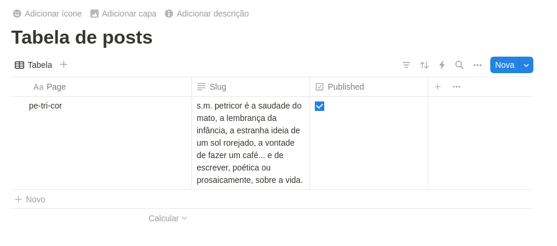

# Olá

Petricor é um saite-blog feito por um completo amador. 

## adicionar postagem

Para adicionar novos arquivos markdown em src/content/, foi criada a função

* src/lib/createNewPost.mjs

a qual pode ser excecutada por meio do plugin [CodeRunner](https://marketplace.visualstudio.com/items?itemName=formulahendry.code-runner), para o [VSCode](https://code.visualstudio.com/). Como consequência, será criado o arquivo

* src/content/post[number].mdx

o qual apresentará um _frontmatter_, tal exemplificado abaixo

```---
id: post2
slug: titulo-do-novo-post
title: Título do Novo Post
date: '2024-09-28T20:31:32.787Z'
mod: null
featured: false
draft: true
tags: []
description: Descrição do novo post
---
Escreva o texto aqui```

Nele, é recomendável alterar o título, o slug (endereço que aparece no navegor) e a descrição do post... acrescentar tags caso quiser e definir **false** para _draft_ quando o texto estiver pronto. E pluft! (_mod_ e _featured_ ainda estão processo de desenvolvimento, de modo que não servem para nada)

## fazer a integração com o Notion

Para integrar com o Notion, é preciso

  1. Criar uma [base de dados](https://www.notion.so/pt/help/create-a-database) no Notion com as seguintes variáveis
    *Page
    *Slug (texto)
    *Published (caixa de checagem)

    

  2. Gerar um [token](https://notion.com/my-integrations) no Notion e
    * copiar e colar a chave em NOTION_TOKEN, no arquivo .env_ex
    * renomear .env_ex para .env
    * [permitir](https://www.notion.so/pt/help/add-and-manage-connections-with-the-api) que essa chave acesse sua base de dados no Notion (muito importante!)

  3. Obter o ID da base de dados do Notion, que pode ser feito de diferentes maneiras... uma delas é copiar o número que aparece no endereço do navegador, mas isso pode ser confuso e frustante. Um jeito mais fácil e certo que encontrei foi criar uma função que retorna esse valor sem muito custo. Para tanto, é necessário
    * garantir que o IDE, como o VSCode, tenha meios de ler as variável de ambiente .env por meio de pacotes como o [dotenv](https://www.npmjs.com/package/dotenv) (ou usá-lo diretamente)
    * ter um meio de visualizar o output das funções no console, como o [sucrase](https://www.npmjs.com/package/sucrase)
    * executar a função src/lib/getNotionId.ts
    * copiar e colar o valor à variável NOTION_DATABASE_ID em .env, já com esse nome

    
